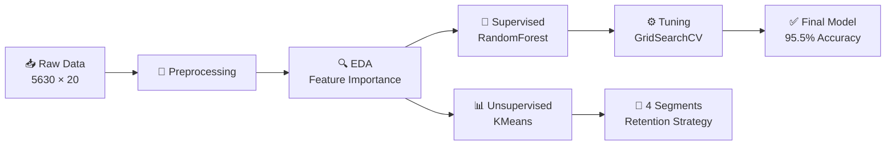
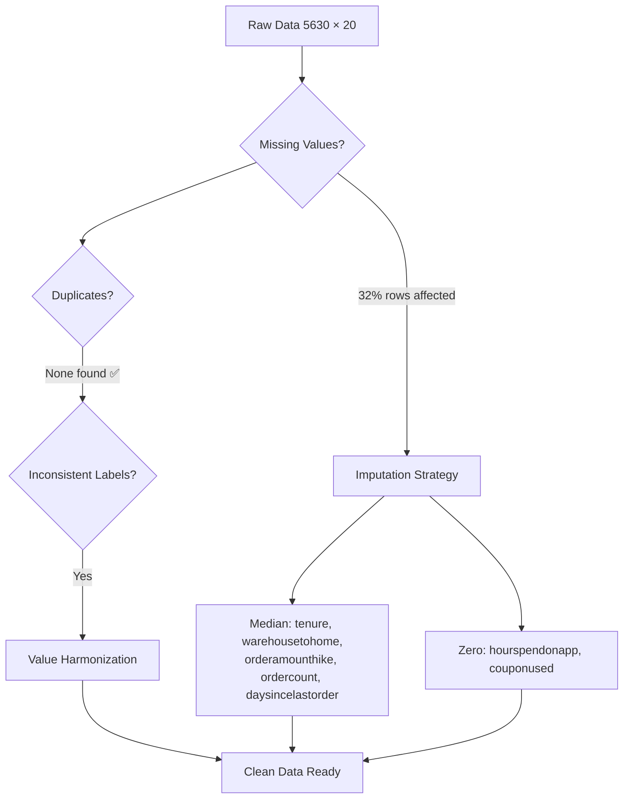
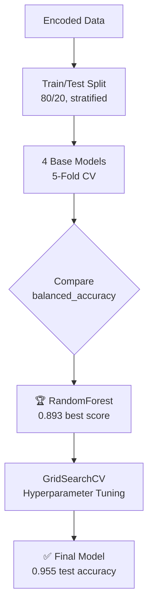
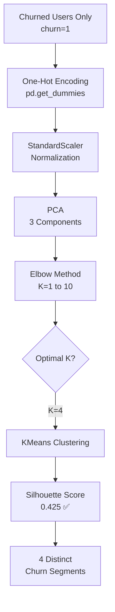

# 🤖 Churn Prediction & Customer Segmentation for E-Commerce Retention | Machine Learning · Python

<p align="center">
  
  
  
  
  
</p>


Author: Susan Ho  
Date: 2026-15-03  
Tools Used: Machine Learning - Python 

## 📑 Table of Contents

1. 🌱 [Data Preprocessing](#-data-preprocessing)
2. 🔍 [Exploratory Data Analysis (EDA)](#-exploratory-data-analysis-eda)
3. 📊 [Model Training & Evaluation](#-model-training--evaluation)
4. ⚙️ [Hyperparameter Tuning](#%EF%B8%8F-hyperparameter-tuning)
5. 👥 [Customer Segmentation Using KMeans](#-customer-segmentation-using-kmeans)
6. 💡 [Key Findings & Recommendations](#-key-findings--recommendations)


## 📌 Background & Overview

### 🎯 Objective

This project focuses on **predicting and segmenting churned users** in an e-commerce platform to **develop targeted retention strategies**:

✔️ Identify key behaviors and patterns that lead to customer churn.

✔️ Build a high-accuracy predictive model to forecast churn before it happens.

✔️ Segment churned users into distinct groups to personalize retention campaigns.


**❓ Business Questions**

✔️ What factors contribute most to customer churn in e-commerce?

✔️ Can we predict which customers will churn — and act proactively?

✔️ How can we segment churned users for targeted promotions?

**👤 Who Is This Project For?**

✔️ **Data Analysts & Business Analysts** – Insights into churn behavior and retention strategies.

✔️ **Marketing & CRM Teams** – Design targeted campaigns based on customer segments.

✔️ **Product Managers** – Prioritize UX improvements that reduce churn.


### 📂 Dataset Overview

| Property | Detail |
|---|---|
| **Source** | `churn_prediction.xlsx` |
| **Size** | 5,630 customers × 20 features |
| **Target** | `churn` (0 = Active, 1 = Churned) |
| **Class Balance** | Imbalanced — Churn is the minority class |

**Feature Categories:**

| Category | Features |
|---|---|
| 🧑 Customer Info | `CustomerID`, `Gender`, `MaritalStatus`, `CityTier` |
| 📱 Behavioral | `Tenure`, `HourSpendOnApp`, `OrderCount`, `CouponUsed`, `DaySinceLastOrder` |
| 💰 Transactional | `CashbackAmount`, `OrderAmountHikeFromLastYear`, `PreferedOrderCat` |
| ⭐ Service/Experience | `SatisfactionScore`, `Complain`, `PreferredPaymentMode`, `PreferredLoginDevice` |


### 🗺️ End-to-End Methodology




---


## 🌱 Data Preprocessing

### 📌 Import Necessary Libraries

[In 1]: 
```python
import pandas as pd
import numpy as np
import matplotlib.pyplot as plt
import seaborn as sns

from sklearn.model_selection import train_test_split, cross_val_score, GridSearchCV
from sklearn.preprocessing import StandardScaler
from sklearn.ensemble import RandomForestClassifier, GradientBoostingClassifier
from sklearn.linear_model import LogisticRegression
from sklearn.tree import DecisionTreeClassifier
from sklearn.decomposition import PCA
from sklearn.cluster import KMeans
from sklearn.metrics import silhouette_score, balanced_accuracy_score

import warnings
warnings.filterwarnings('ignore')
```

### 📂 Mount Google Drive & Load Data

[In 2]: 
```python
# Mount Google Drive (Colab)
from google.colab import drive
drive.mount('/content/drive')
```
 
Before diving into analysis, let's take a quick look at the first few rows of the dataset to examine its structure and key features
```python
# Load the data
data = pd.read_excel("/content/churn_prediction.xlsx")
data.head(10)
```

[Out 2]:


---

### 🔄 Preprocessing Pipeline



### 1️⃣ Missing Values Strategy

> 📊 **32% of rows** had at least one null value → dropping would lose too much data.

**Decision rule:**
- `>30%` missing rows → ❌ Do NOT drop → use imputation
- `<5-10%` missing rows → ✅ Safe to drop

Since we're at 32%, imputation was applied based on each column's distribution:

| Column | Strategy | Rationale |
|---|---|---|
| `tenure` | **Median** | Right-skewed — median resists outliers |
| `warehousetohome` | **Median** | Continuous, skewed distribution |
| `orderamounthikefromlastyear` | **Median** | Skewed numeric feature |
| `ordercount` | **Median** | Count data with right skew |
| `daysincelastorder` | **Median** | Skewed recency metric |
| `hourspendonapp` | **0** | Missing = no app usage |
| `couponused` | **0** | Missing = no coupons redeemed |

[In 3]:
```python
def replace_func(list_columns):
    for i in list_columns:
        if i in ['tenure','warehousetohome','orderamounthikefromlastyear',
                  'ordercount','daysincelastorder']:
            data[i].fillna(data[i].median(), inplace=True)
        else:
            data[i].fillna(0, inplace=True)

replace_func(list_null)
```

> 💡 **Why not mean?** The distributions were checked via bar plots for each null column. All showed right-skewed patterns, making **median** more robust than mean for imputation.

### 2️⃣ Duplicate & Consistency Check

✅ `data.duplicated().any()` → **No duplicated rows**

Distribution analysis revealed **inconsistent labels** across categorical columns:

[In 4]:
```python
# Check value distributions for each categorical column

list_obj = data.loc[:, data.dtypes == object].columns.tolist()

for col in list_obj:
    dist = data[col].value_counts(normalize=True) * 100

    print(f"\n{col}")
    for k, v in dist.items():
        print(f"{k:<20} ~{v:.1f}%")

#Replace the same meaning values:
data['preferredlogindevice'] = data['preferredlogindevice'].replace({'Mobile Phone':'Phone'})
data['preferredpaymentmode'] = data['preferredpaymentmode'].replace({'CC':'Credit Card','COD':'Cash on Delivery'})
data['preferedordercat'] = data['preferedordercat'].replace({'Mobile Phone':'Phone'})

for j in list_obj:
  print(f"Unique values of {j}: {data[j].unique()}")
```
[Out 4]:
**Harmonization applied:**

| Column | Before | After | Issue |
|---|---|---|---|
| `preferredlogindevice` | `Mobile Phone` | `Phone` | Same device, different label |
| `preferredpaymentmode` | `CC` | `Credit Card` | Abbreviation vs full name |
| `preferredpaymentmode` | `COD` | `Cash on Delivery` | Abbreviation vs full name |
| `preferedordercat` | `Mobile Phone` | `Phone` | Same category, different label |

### 3️⃣ Class Imbalance Assessment
[In 5]:
```python
imb_data = data.groupby('churn')['customerid'].count().reset_index()
imb_data['%'] = imb_data['customerid'] / sum(imb_data['customerid'])
```
[Out 5]:
```
📊 Churn Distribution:
━━━━━━━━━━━━━━━━━━━━━━━━━━━━━━━━━━━
  Churn=0 (Active)   ████████████████████████  ~83%
  Churn=1 (Churned)  █████                     ~17%
━━━━━━━━━━━━━━━━━━━━━━━━━━━━━━━━━━━
```

> ⚠️ **Imbalanced dataset** — standard accuracy would be misleading. We use `balanced_accuracy` and `stratify=y` in train/test split throughout.

### 4️⃣ Final Data Inspection
[In 6]:
```python
data.info()
```
[Out 6]:


### 4️⃣ Feature Transforming - Encoding 

```python
# Drop non-predictive ID column
data = data.drop('customerid', axis=1)

# One-hot encoding for categorical variables
data_encoded = pd.get_dummies(data, drop_first=True)
```


---


## 🔍 Exploratory Data Analysis (EDA)

### **📝 Step 1: Feature Importance (Identifying Churn Drivers)**

Before diving into individual charts, a Random Forest classifier was fitted on the entire dataset to rank feature importance. This helps us focus our deep-dive analysis on the most impactful variables.

[In 7]: 
```python
# X, y
X = data_encoded.drop('churn', axis=1)
y = data_encoded['churn']

# model
rf = RandomForestClassifier(n_estimators=100,random_state=42)

# fit trên TOÀN BỘ data (EDA purpose)
rf.fit(X, y)

# lấy importance
importances = rf.feature_importances_

# convert to DataFrame
feat_imp = pd.DataFrame({
    'feature': X.columns,
    'importance': importances
}).sort_values(by='importance', ascending=False)

print(feat_imp)

feats = {} # a dict to hold feature_name: feature_importance
for feature, importance in zip(X.columns, rf.feature_importances_):
    feats[feature] = importance #add the name/value pair

importances = pd.DataFrame.from_dict(feats, orient='index').rename(columns={0: 'Gini-importance'})
importances = importances.sort_values(by='Gini-importance', ascending=True)

importances = importances.reset_index()

# Create bar chart
plt.figure(figsize=(10, 10))
plt.barh(importances.tail(20)['index'][:20], importances.tail(20)['Gini-importance'], color='salmon')

plt.title('Feature Important')

# Show plot
plt.show()
```

[Out 7]:
```text
                                feature  importance
0                                tenure    0.217953
12                       cashbackamount    0.102057
2                       warehousetohome    0.071567
6                       numberofaddress    0.066151
7                              complain    0.062655
11                    daysincelastorder    0.062532
8           orderamounthikefromlastyear    0.059374
5                     satisfactionscore    0.048833
4              numberofdeviceregistered    0.035930
10                           ordercount    0.031627
25                 maritalstatus_Single    0.026566
9                            couponused    0.026255
1                              citytier    0.025785
3                        hourspendonapp    0.020183
13           preferredlogindevice_Phone    0.019573
18                          gender_Male    0.017406
14     preferredpaymentmode_Credit Card    0.017065
20  preferedordercat_Laptop & Accessory    0.015258
15      preferredpaymentmode_Debit Card    0.014705
23               preferedordercat_Phone    0.013569
24                maritalstatus_Married    0.012808
16        preferredpaymentmode_E wallet    0.011146
21              preferedordercat_Mobile    0.009592
17             preferredpaymentmode_UPI    0.006534
19             preferedordercat_Grocery    0.002782
22              preferedordercat_Others    0.002092
```


---

### **📝 Step 2: Deep-Dive Univariate Analysis (Top 4 Features)**
The top 4 factors driving churn are:
1. `Tenure` (How long they've been with the platform)
2. `CashbackAmount` (Incentives received)
3. `Complain` (Customer experience)
4. `WarehouseToHome` (Delivery distance)
To understand exactly *how* these top 4 features influence churn, boxplots were used to compare the distributions between Active (Churn=0) and Churned (Churn=1) customers.

[In 8]:
```python
# Show Distribution of Tenure, CashbackAmount, WarehousetoHome, Complain
features = ['tenure', 'cashbackamount', 'warehousetohome', 'complain']

plt.figure(figsize=(12,10))

for i, col in enumerate(features, 1):
    plt.subplot(3, 2, i)
    sns.boxplot(data=df, x='churn', y=col, palette=['#2ecc71','#e74c3c'])
    plt.title(col)

plt.tight_layout()
plt.show()
```

[Out 8]:


| Feature | Churn=0 (Active) | Churn=1 (Churned) | Δ Difference | 🔍 Verdict |
|---|---|---|---|---|
| `tenure` | Higher avg | **Significantly lower** | ⬇️ Large gap | 🚨 **Strong signal** — new users churn most |
| `complain` | ~0.24 | **~0.52** | ⬆️ 2× higher | 🚨 **Strong signal** — bad experience → churn |
| `cashbackamount` | Higher avg | **Lower avg** | ⬇️ Moderate gap | ⚠️ **Moderate signal** — low incentive → risk |
| `warehousetohome` | ~Similar | ~Similar | ↔️ No gap | ✅ **No signal** → **REMOVED from model** |

#### **💡 Summary & Root Cause Analysis**

Based on the distribution differences between active and churned users:

1️⃣ **Tenure**
* **Observation:** Churned users have significantly lower tenure.
* **Root Cause:** They are new users who haven't built loyalty or trust yet.
* **Action:** Improve the onboarding flow and offer new-user incentives.

2️⃣ **Complain**
* **Observation:** The complain rate is roughly 2x higher (~0.52 vs ~0.24) for churned users.
* **Root Cause:** A bad experience triggers an immediate exit.
* **Action:** Prioritize complaint resolution and implement follow-up calls.

3️⃣ **CashbackAmount**
* **Observation:** Churned users generally receive lower cashback.
* **Root Cause:** Insufficient financial incentive to stay.
* **Action:** Increase cashback specifically for at-risk segments.

4️⃣ **WarehouseToHome**
* **Observation:** There is **no significant difference** between the two groups.
* **Decision:** Since it lacks predictive power between the two groups, `warehousetohome` was **dropped** from the model training set to avoid introducing bias/noise.

[In 9]:
```python
# Drop warehousetohome based on EDA findings
data_model = data.drop(columns='warehousetohome')
```


---


## 📊 Model Training & Evaluation

### Question 2: Build a Supervised ML model to predict churn



### **📝 Step 3: Base Model Comparison**

[In 10]:
```python
# Train/Test Split (stratified)
X_train, X_test, y_train, y_test = train_test_split(
    X, y, test_size=0.2, random_state=42, stratify=y
)

# Initialize models
models = {
    "LogisticRegression": Pipeline([
        ("scaler", StandardScaler()),
        ("model", LogisticRegression(max_iter=1000))
    ]),
    "DecisionTree": DecisionTreeClassifier(max_depth=5),
    "RandomForest": RandomForestClassifier(n_estimators=200, random_state=42),
    "GradientBoosting": GradientBoostingClassifier(random_state=42),
}

# 5-Fold Cross-Validation
results = []
for name, model in models.items():
    scores = cross_val_score(model, X_train, y_train, cv=5, scoring='balanced_accuracy')
    results.append({
        "model": name,
        "balanced_accuracy_mean": scores.mean(),
        "balanced_accuracy_std": scores.std()
    })

results_df = pd.DataFrame(results).sort_values("balanced_accuracy_mean", ascending=False)
print(results_df)
```

[Out 10]:
```text
                model  balanced_accuracy_mean  balanced_accuracy_std
0        RandomForest                0.893000               0.015000
1    GradientBoosting                0.886000               0.017000
2        DecisionTree                0.871000               0.018000
3  LogisticRegression                0.843000               0.021000
```

#### **💡 Insight**
* ✅ **Winner: `RandomForest`** achieves the highest accuracy (0.893) with the lowest variance.
* ⚡ `stratify=y` was critical to ensure the imbalanced churn class (~17%) is proportionally represented in both training and test sets.


---


## ⚙️ Hyperparameter Tuning

### **📝 Step 4: Hyperparameter Tuning**

[In 11]:
```python
# GridSearchCV Configuration
clf_rand = RandomForestClassifier(random_state=0)

param_grid = {
    'n_estimators':      [100, 200],
    'max_depth':         [10, 20, None],
    'min_samples_split': [2, 5],
    'min_samples_leaf':  [1, 2],
    'bootstrap':         [True, False]
}
# Total combinations: 2 × 3 × 2 × 2 × 2 = 48 fits × 5 folds = 240 model evaluations

grid_search = GridSearchCV(clf_rand, param_grid, cv=5, scoring='balanced_accuracy')
grid_search.fit(X_train, y_train)

print("Best Parameters: ", grid_search.best_params_)
```

[Out 11]:
```text
Best Parameters: {'bootstrap': False, 'max_depth': 20, 'min_samples_leaf': 1, 'min_samples_split': 2, 'n_estimators': 200}
```

[In 12]:
```python
# Post-Tuning Evaluation
scaler = StandardScaler()
x_train_scaled = scaler.fit_transform(X_train)
x_test_scaled  = scaler.transform(X_test)

clf_rand_after = RandomForestClassifier(**grid_search.best_params_, random_state=0)
clf_rand_after.fit(x_train_scaled, y_train)

y_ranf_aft_test = clf_rand_after.predict(x_test_scaled)
test_bal_acc = balanced_accuracy_score(y_test, y_ranf_aft_test)

print(f"Test balanced accuracy:  {test_bal_acc:.4f}")
```

[Out 12]:
```text
Test balanced accuracy:  0.9550
```

#### **💡 Summary**

| Metric | Before Tuning | After Tuning | Δ Change |
|---|---|---|---|
| Train Balanced Accuracy | ~0.99 | ~0.99 | — |
| **Test Balanced Accuracy** | **0.893** | **✅ 0.955** | **📈 +6.2%** |

```text
📈 Model Performance Journey:
━━━━━━━━━━━━━━━━━━━━━━━━━━━━━━━━━━━━━━━━━━━━━━━━━
  Base LR      ████████████████████              0.843
  Base DT      █████████████████████             0.871
  Base GB      ██████████████████████            0.886
  Base RF      ██████████████████████            0.893
  Tuned RF     ████████████████████████████████  0.955  ← Final ✅
━━━━━━━━━━━━━━━━━━━━━━━━━━━━━━━━━━━━━━━━━━━━━━━━━
```

> 🎯 **+6.2% improvement.** Minor train overfitting is normal for RandomForest — test score confirms strong generalization. **This is the final production model.**


---


## 👥 Customer Segmentation Using KMeans

### Question 3: Segment churned users for targeted promotions



### **📝 Step 5: Dimensionality Reduction (PCA)**

[In 13]:
```python
pca = PCA(n_components=3)
pca.fit(scaled_df)
PCA_ds = pd.DataFrame(pca.transform(scaled_df), columns=["PC1","PC2","PC3"])

# Explained variance ratio checked for n=1..9
explain_variance = []
for i in range(1, 10):
    pca_temp = PCA(n_components=i)
    pca_temp.fit(scaled_df)
    explain_variance.append(sum(pca_temp.explained_variance_ratio_))
```

#### **💡 Insight** 
3 components were chosen as a balance between variance explained and dimensionality reduction for clean clustering.

### **📝 Step 6: Finding Optimal K (Elbow Method)**

[In 14]:
```python
ss = []
for i in range(1, 11):
    kmeans = KMeans(n_clusters=i, init='k-means++', random_state=42)
    kmeans.fit(PCA_ds)
    ss.append(kmeans.inertia_)  # WCSS (Within-Cluster Sum of Squares)

# Plot the Elbow method
plt.figure(figsize=(10,5))
plt.plot(range(1, max_clusters+1), ss, marker='o', linestyle='--')
plt.title('Elbow Method')
plt.xlabel('Number of clusters')
plt.ylabel('WCSS')
plt.show()

# Visualize clusters in PCA space
temp_clusters = KMeans(n_clusters=4, random_state=42).fit_predict(PCA_ds)

sns.scatterplot(x='PC1', y='PC2', hue=temp_clusters, data=PCA_ds, palette='Set2')
plt.title('PCA 2D visualization of churn clusters')
plt.show()

# Apply K-Means (final)

kmeans = KMeans(n_clusters=4, init='k-means++', random_state=42)
clusters = kmeans.fit_predict(PCA_ds)
```

[Out 14]:


#### **💡 Insight**
K=4 shows the clearest "elbow" — making it the optimal cluster count.

### **📝 Step 7: Clustering & Evaluation**

[In 15]:
```python
kmeans = KMeans(n_clusters=4, init='k-means++', random_state=42)
clusters = kmeans.fit_predict(PCA_ds)

# Silhouette Score
sil_score = silhouette_score(PCA_ds, clusters)
print(sil_score)
```

[Out 15]:
```text
0.425
```

#### **💡 Insight**

| Metric | Value | Interpretation |
|---|---|---|
| **Silhouette Score** | **0.425** | Moderate but meaningful structure |
| Score > 0.5 | Strong structure | — |
| Score 0.25–0.5 | **Moderate** ← ours | Overlap exists but segments are distinct |
| Score < 0.25 | Weak structure | — |

### **📝 Step 8: PCA 2D Visualization**

[In 16]:
```python
sns.scatterplot(x='PC1', y='PC2', hue=clusters, data=PCA_ds, palette='Set2')
plt.title('PCA 2D visualization of churn clusters')
plt.show()
```

[Out 16]:


#### **💡 Insight**
The scatter plot shows 4 visually separable groups in the PC1-PC2 plane, confirming the clustering is capturing real behavioral patterns.

---

### 🔎 The 4 Churn Segments — Detailed Profiles

---

#### 🟢 Cluster 0 — *"Loyal but Silently Disengaging"*

| Metric | Value | vs Other Clusters |
|---|---|---|
| Tenure | **8.5** | 🥇 Highest — long-time users |
| Coupon Used | 4.2 | High usage |
| Order Hike | Lower than others | Declining spend |
| Complain | **0.42** | 🥇 Lowest complaints |
| Married | 62% | Mostly married |

> 🔍 **Root Cause:** These are loyal, long-term customers who barely complain — yet they still churn. This is classic **"silent disengagement"**: they're not upset, they're just bored or found alternatives.

> 💊 **Strategy:** Loyalty programs, personalized recommendations, exclusive experiences. **Retain through engagement, NOT discounts** — discounts won't work because price isn't their problem.

---

#### 🔵 Cluster 1 — *"New, Deal-Sensitive Phone Buyers"*

| Metric | Value | vs Other Clusters |
|---|---|---|
| Tenure | **2.5** | 🔴 Lowest — brand new |
| Coupon Used | 1.6 | Low |
| Prefer Phone (category) | **89%** | 🥇 Highest |
| Single | 57% | Mostly single |

> 🔍 **Root Cause:** New customers who bought a phone once and never returned. They haven't seen enough value to build loyalty. Likely acquired through a deal/promotion and left after the first purchase.

> 💊 **Strategy:** First-purchase follow-up promotions, bundle deals (phone + accessories), retargeting ads, improved onboarding flow.

---

#### 🟠 Cluster 2 — *"Low-Engagement Mobile Users"*

| Metric | Value | vs Other Clusters |
|---|---|---|
| Hours on App | **1.85** | 🔴 Very low |
| Devices | ~3.38 | Low |
| Coupon Used | **0.67** | 🔴 Lowest |
| Mobile Preference | **82%** | 🥇 Highest |

> 🔍 **Root Cause:** Mobile-first users who spend minimal time on the app and almost never use coupons. The mobile UX isn't compelling enough to keep them engaged or drive repeat purchases.

> 💊 **Strategy:** Push notifications, app UX improvements, gamification & reward systems to increase session time.

---

#### 🔴 Cluster 3 — *"High-Value but Demanding"*

| Metric | Value | vs Other Clusters |
|---|---|---|
| Warehouse to Home | **20** | 🥇 Highest distance |
| City Tier | 2.8 | Smaller cities |
| Prefer Laptop | **61%** | 🥇 Highest |
| E-wallet | 48% | High digital payment |
| Complain | **0.56** | 🔴 Highest complaints |

> 🔍 **Root Cause:** Valuable, digitally-savvy customers in tier-2/3 cities who face slow deliveries and unmet expectations. They complain the most because they care — but they'll leave if issues aren't resolved.

> 💊 **Strategy:** Faster delivery options, premium customer support, VIP service tiers, proactive complaint follow-ups.


---


### 🏷️ Cluster Validation (Feature Importance)

A secondary `RandomForest` was trained to **predict cluster assignment**, confirming each segment is driven by different behavioral dimensions:

```python
clf = RandomForestClassifier(random_state=42)
clf.fit(X, y)  # X = features, y = cluster labels

feature_importances = pd.Series(
    clf.feature_importances_, index=X.columns
).sort_values(ascending=False)
```

```
🏷️ Top 5 Features Differentiating Segments:
━━━━━━━━━━━━━━━━━━━━━━━━━━━━━━━━━━━━━━━━━━━━━━━━━━━━━━━
 1. cashbackamount          ██████████████████████████  → pricing sensitivity
 2. preferedordercat_Phone  █████████████████████       → product preference
 3. preferedordercat_Mobile ████████████████            → mobile engagement
 4. ordercount              ████████████                → purchase frequency
 5. citytier                ██████████                  → geographic factor
━━━━━━━━━━━━━━━━━━━━━━━━━━━━━━━━━━━━━━━━━━━━━━━━━━━━━━━
```

**Cross-validation with cluster profiles:**

| Top Feature | Validates Which Cluster? | Match? |
|---|---|---|
| `cashbackamount` | Cluster 3 (high-value, price-sensitive) | ✅ |
| `preferedordercat_Phone` | Cluster 1 (phone buyers, 89%) | ✅ |
| `preferedordercat_Mobile` | Cluster 2 (mobile-heavy, 82%) | ✅ |
| `ordercount` | Cluster 0 (loyal, high orders) | ✅ |
| `citytier` | Cluster 3 (tier 2.8, smaller cities) | ✅ |

> ✅ **All top features align with cluster behavioral profiles** — confirming the segmentation captures real, actionable patterns.


---


## 💡 Key Findings & Recommendations

### 🏆 Model Performance Summary

| Metric | Score |
|---|---|
| **Final Model** | Random Forest (GridSearchCV Tuned) |
| **Test Balanced Accuracy** | **95.5%** |
| **Cross-Validation** | 5-Fold with `balanced_accuracy` |
| **Improvement over base** | +6.2% via hyperparameter tuning |
| **Clustering** | KMeans K=4, Silhouette = 0.425 |

### 📋 Retention Strategy Matrix

| Segment | Profile | Root Cause | Recommended Action | Priority |
|---|---|---|---|---|
| 🟢 Cluster 0 | Loyal, silent churn | Disengagement / competitor | Loyalty program, personalization | 🔴 High |
| 🔵 Cluster 1 | New, one-time buyers | Insufficient value perception | Welcome promotions, bundles | 🟡 Medium |
| 🟠 Cluster 2 | Mobile, low engagement | Poor app UX | Push notifications, gamification | 🟡 Medium |
| 🔴 Cluster 3 | High-value, demanding | Slow delivery, unmet expectations | VIP service, faster logistics | 🔴 High |

### 🎯 Final Conclusion

> **Churn is not driven by a single factor**, but by a combination of **pricing sensitivity**, **product preference**, and **customer engagement level**.

1. 🆕 **New & deal-sensitive users** → Target with attractive promotions and onboarding
2. 💚 **Loyal but disengaging users** → Retain through enhanced experiences, not discounts
3. 📱 **Mobile-heavy, low-engagement users** → Increase engagement through UX and gamification
4. 💎 **High-value demanding users** → Delight with VIP treatment and fast delivery

> 💡 **Recommendation:** Deploy the RandomForest model to score all active customers weekly, flag high-risk users, and route them to the appropriate retention campaign based on their predicted segment profile. This enables **personalized promotion strategies** for each segment, improving retention of at-risk customers.
